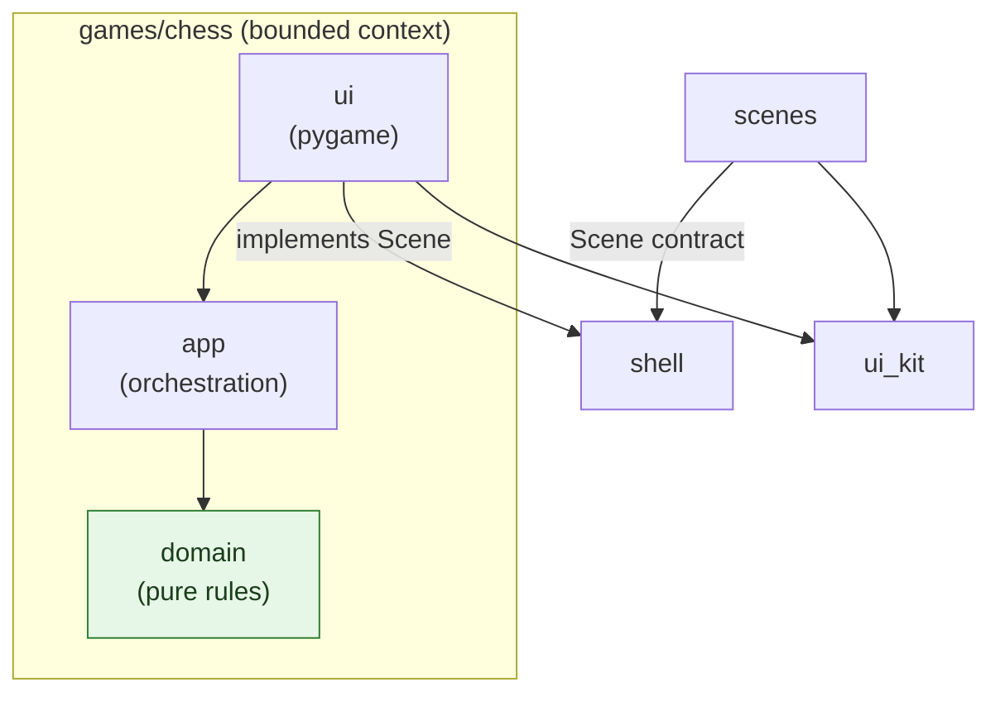
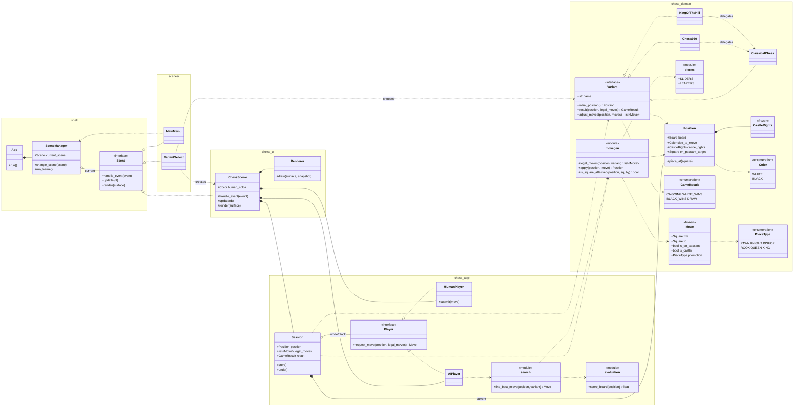

# Architecture UML

Open with any Mermaid-preview extension (e.g. *Markdown Preview Mermaid Support*).
Two views: (1) layer dependencies, (2) the class diagram.

> If your extension bundles an old Mermaid and the `namespace { }` blocks fail to
> render, just delete the `namespace ... {` / matching `}` lines — the classes and
> relationships render fine without them.

## 1. Layer dependencies (arrows = "depends on")

`domain` is **pure**: it imports nothing outward (no pygame, no app, no ui). That
green box is the invariant to protect — enforce it with pyright/mypy strict.

## 2. Class diagram

### Legend

| Arrow | Meaning |
| --- | --- |
| `<\|..` | implements / realizes interface |
| `*--` | composition (owns; lifecycle-bound) |
| `o--` | aggregation (references / holds) |
| `..>` | dependency (uses) |
